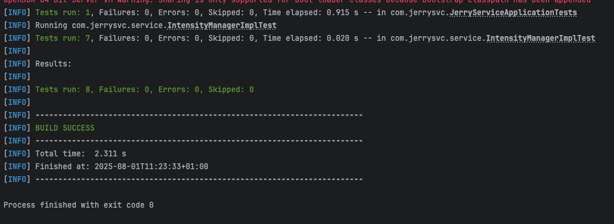

# Intensity Segment Manager

A program that manages “intensity” by segments. Segments are intervals from -infinity to infinity, functions that updates 
intensity by an integer amount for a given range. All intensity starts with 0.

## Methods exposed 
### `add(from, to, amount)`
### `set(from, to, amount)`  

## How to Run Tests
```bash
mvn test
```

## Screenshots


